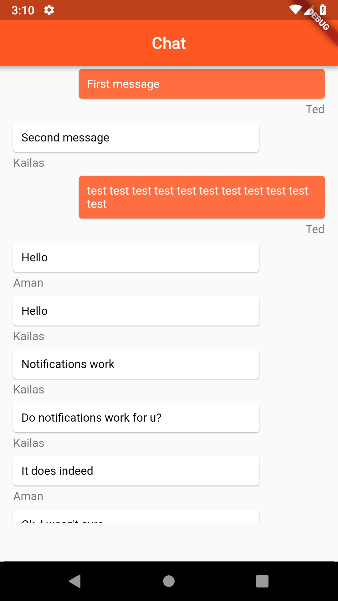

# Flutter Chat

Flutter Chat is a simple chat room app built using Flutter and Firebase. It uses Flutter as a crossplatform framework for ios and android and is written in Dart. It uses Firestore realtime database to handle messages. 

